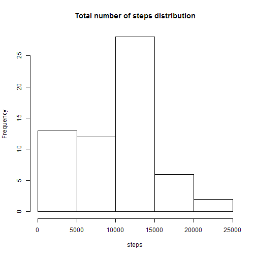
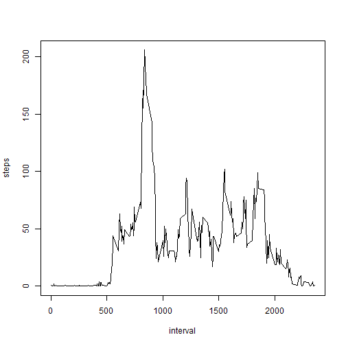
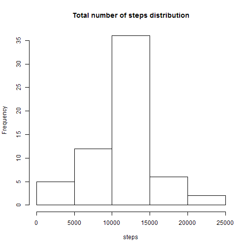
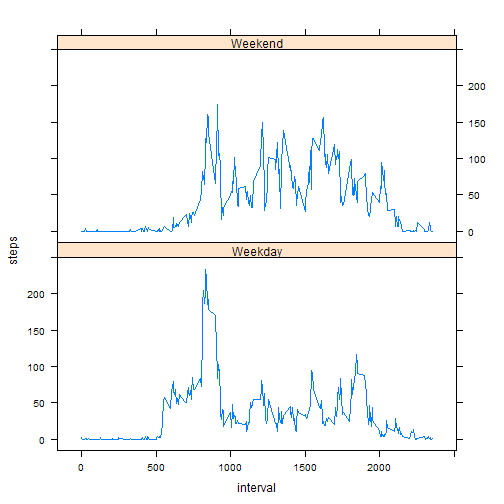

# Reproducible Research: Peer Assessment 1


## 1 Loading and preprocessing the data
### 1.1 Load data into "data" by read.csv()

```r
data <- read.csv("activity.csv")
```

### 1.2 Transform data$date to Date format by as.Date()

```r
data$date <- as.Date(data$date)
```


## 2 What is mean total number of steps taken per day?
### 2.1 The histogram of the total number of steps taken each day is show as below:


```r
hist(tapply(data$steps, data$date, sum, na.rm = TRUE), main = "Total number of steps distribution", 
    xlab = "steps", ylab = "Frequency")
```

 


### 2.2 The mean and median total number of steps taken per day 


```r
mean(tapply(data$steps, data$date, sum, na.rm = TRUE))
```

```
## [1] 9354
```

```r
median(tapply(data$steps, data$date, sum, na.rm = TRUE))
```

```
## [1] 10395
```


## 3 What is the average daily activity pattern?
### 3.1 The time series plot

```r
library(sqldf)
```

```
## Loading required package: gsubfn
## Loading required package: proto
## Loading required package: RSQLite
## Loading required package: DBI
## Loading required package: RSQLite.extfuns
```

```r
tmp3 <- sqldf("select interval, avg(steps) as steps from data where steps>=0 group by interval order by interval")
```

```
## Loading required package: tcltk
```

```r
plot(tmp3$interval, tmp3$steps, type = "l", xlab = "interval", ylab = "steps")
```

 


### 3.2 The interval that contains the maximum number of steps

```r
tmp <- tapply(data$steps, data$interval, sum, na.rm = TRUE)
index <- as.numeric(names(tmp))
num <- as.numeric(tmp)
index[which(num == max(num))]
```

```
## [1] 835
```


## 4 Imputing missing values
### 4.1 Total number of missing values in the dataset

```r
length(data[which(is.na(data$steps)), 1])
```

```
## [1] 2304
```

### 4.2 Filling in all of the missing values with the **mean** for that 5-minute interval

```r
## Get the mean steps for each interval
tmp4 <- tapply(data$steps, data$interval, mean, na.rm = TRUE)
## Get the interval name
tmpnames <- as.integer(names(tmp4))
## Get the mean value
tmpvalues <- as.integer(tmp4)
## For each missing steps, find the interval name and then get the
## corresponding mean value and then fill in the missing value by that mean
## value
result <- sapply(which(is.na(data$steps)), function(x) data[x, 1] <- tmpvalues[which(tmpnames == 
    data[x, 3])])
```

### 4.3 The new dataset that is equal to the original dataset but with the missing data filled in

```r
newdata <- data
newdata[which(is.na(newdata$steps)), 1] <- result
```


### 4.4 The histogram

```r
## The histogram
hist(tapply(newdata$steps, newdata$date, sum, na.rm = TRUE), main = "Total number of steps distribution", 
    xlab = "steps", ylab = "Frequency")
```

 

```r
## The mean
mean(tapply(newdata$steps, newdata$date, sum, na.rm = TRUE))
```

```
## [1] 10750
```

```r
## The median
median(tapply(newdata$steps, newdata$date, sum, na.rm = TRUE))
```

```
## [1] 10641
```

The mean and the median increase. The missing is filled in with the mean for that interal, so the total steps for each day increase and as an result, the mean for the total steps each day increase.
According to the time series in 3.1, it is a little left skewed, so the mean is a little more that the median. When we use the mean interval value to fill in the missing, the median for the total steps each day increase.


## 5 Are there differences in activity patterns between weekdays and weekends?
### 5.1 Create a nwe variable named weekend in the dataset

```r
## Add the variable and initialed with '0'
data$weekend <- "Weekday"
data[which(weekdays(as.Date(data$date)) %in% c("Saturday", "Sunday")), "weekend"] <- "Weekend"
```

### 5.2 The plot

```r
library(lattice)
tmp5 <- sqldf("select interval, weekend, avg(steps) as steps from data where steps>=0 group by interval, weekend order by interval")
xyplot(steps ~ interval | weekend, data = tmp5, type = "l", layout = c(1, 2))
```

 


